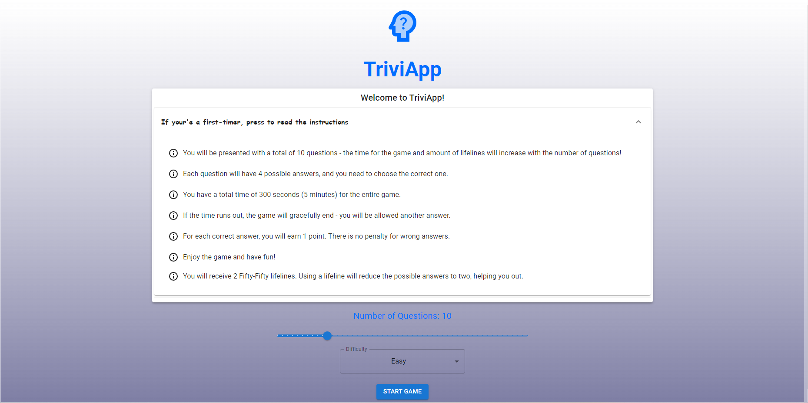
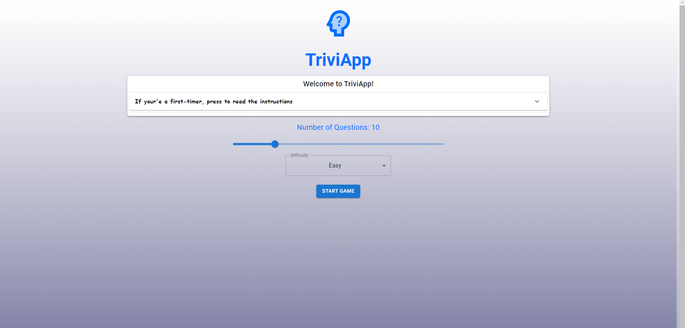
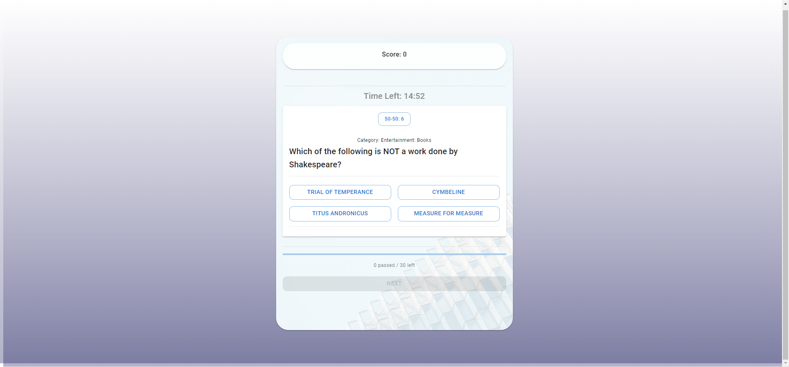
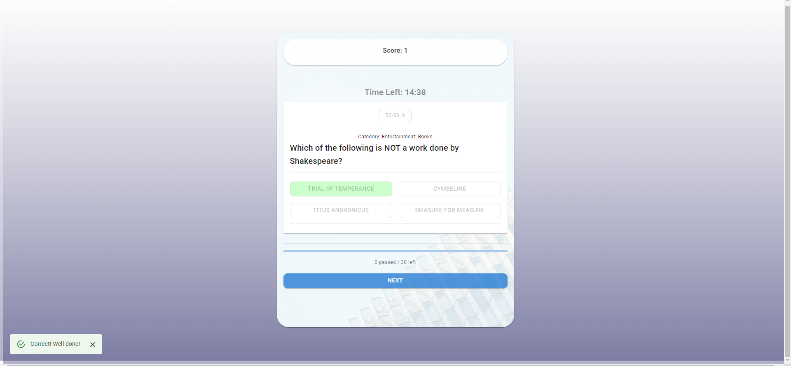
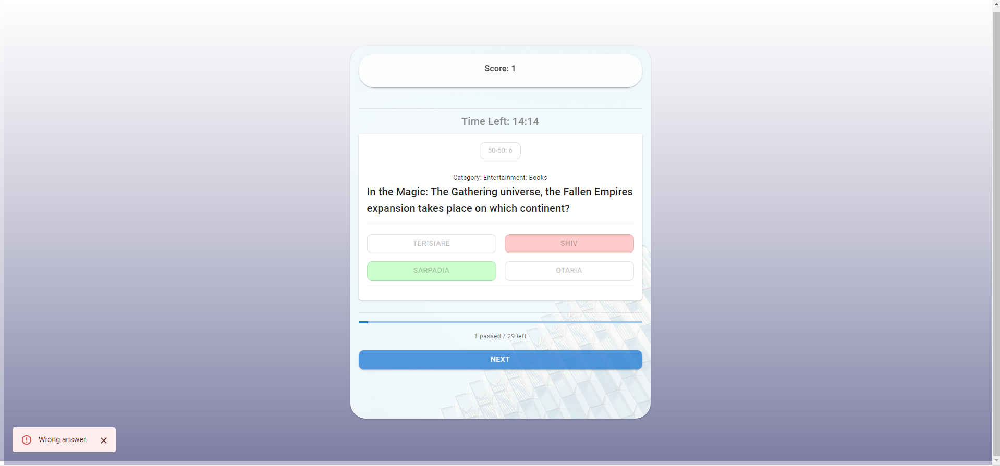
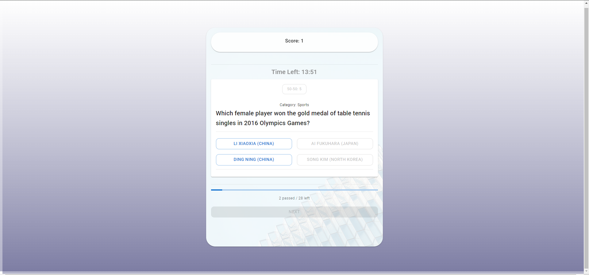

# Welcome to TriviApp! Brief explanation with screenshots and use-cases:
In the settings page you can expand the 'Accordion' element to read the instructions. You can customize the number of questions to fetch (anything between 1 to 50) and the difficulty (easy, medium or hard).

The amount of questions you choose increases the amount of time and "50-50 Lifelines" you receive.

You will be displayed with a question including the category it comes from, and 4 answer choices. 

You will be provided with a feedback in a form of: An effect painting the chosen wrong answer in red and the correct one in green, or, if you were correct, the correct one in green alone. Also a snackbar at the bottom left of the screen will pop-up with the appropriate style and message. Last but not least, audio feedback for button clicks, correct, and wrong answers.

The incorrect answer sound is awful, try being correct. The correct answer sound is rewarding though. At the bottom you can see a progress indicator - both visual and textual.

You can use a "50-50 Lifeline" to reduce the number of choices to two. You get 1 of those for every 5 questions. Use it with caution.

Eventually, you will be indicated regarding your final score. You will be given the option to go back to settings page to customize the settings, or restart with new questions of the same settings.

If the timer expires before you managed to answer on all questions - the game will gracefully end (letting you pick your last answer before it ends).

# Getting Started with Create React App

This project was bootstrapped with [Create React App](https://github.com/facebook/create-react-app).

## Available Scripts

In the project directory, you can run:

### `npm start`

Runs the app in the development mode.\
Open [http://localhost:3000](http://localhost:3000) to view it in the browser.

The page will reload if you make edits.\
You will also see any lint errors in the console.

